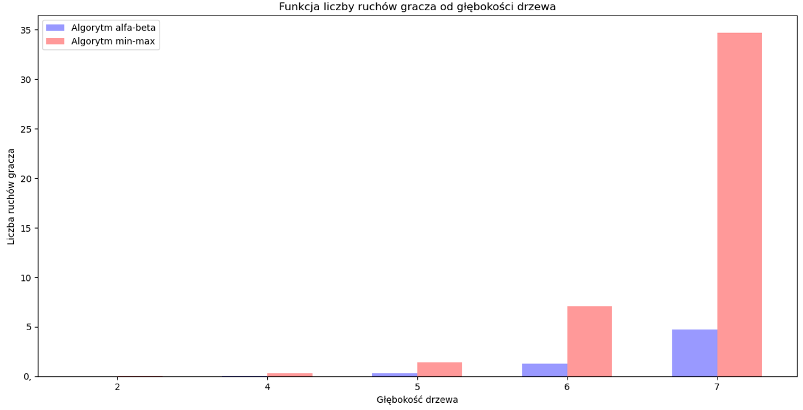
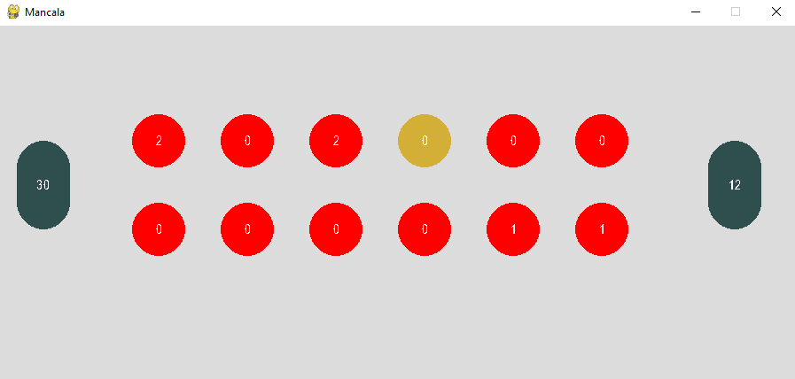

# Mancala Game
AI decision-making process:  
Before starting the evaluation of the board states, the board fields to be used in the analysis should be extracted and evaluated. A decision must then be made to select the most promising moves. The selection starts from the root of the tree. The program then creates descendant nodes in a loop until it reaches a value symbolising the leaf of the tree. Once the loop is complete, the program runs simulations based on the selected nodes until the final depth of the tree is reached. During this process, the program saves the node with which the simulation finished best. Through back propagation, the information in the nodes is updated.

Implementation of 2 different heuristics for the functions evaluation of game board states and decision making:
- Minimax algorithm  
The minimax algorithm performs a depth-first search algorithm for the exploration of the complete game tree.  
In this algorithm two players play the game, one is called MAX and other is called MIN. Both the players fight it as the opponent player gets the minimum benefit while they get the maximum benefit. Both Players of the game are opponent of each other, where MAX will select the maximized value and MIN will select the minimized value.

- Alpha–beta pruning  
Alpha-beta pruning is a modified version of the minimax algorithm. The Alpha-beta pruning to a standard minimax algorithm returns the same move as the standard algorithm does, but it removes all the nodes which are not really affecting the final decision but making algorithm slow. Hence by pruning these nodes, it makes the algorithm faster.
The two-parameter can be defined as:  
Alpha: The highest-value choice we have found so far at any point along the path of Maximizer.
Beta: The lowest-value choice we have found so far at any point along the path of Minimizer.

Comparison of the number of moves AI winning vs AI with algorithm 
min-max vs alpha-beta for different tree depths:
- tree depth = 2,
- tree depth = 4,
- tree depth = 5,
- tree depth = 6,
- tree depth = 7,

Visualization of game board:

